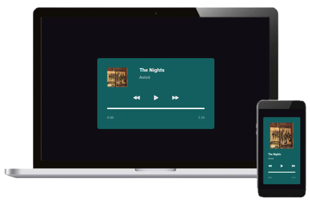

<h1 align="center" >Projeto Player Music 🎶</h1>

  

## 💻 Projeto

Este projeto foi desenvolvido com base no desafio semanal #boraCodar promovido pela Rocketseat.

Foram desenvolvidas novas funcionalidades ao projeto, como:
- Tocar a música ao apertar o play ou automaticamente ao terminar. 
- Trocar as músicas ao clicar no botão avançar ou voltar.
- Barra de progresso avança de acordo com o tempo da música.
- Imagens e nome da banda trocam de acordo com a música;
- Responsivo para celular e computador.
- Liberdade para alterar a cor de fundo.

Você pode visualizar o projeto através [DESSE LINK](https://luisloschi.github.io/Player-Music/).

## 🚀 Tecnologias
Esse projeto foi desenvolvido com as seguintes tecnologias:

- HTML
- CSS
- JavaScript

## 🔖 Layout
Você pode visualizar o layout de inspiração do projeto através [DESSE LINK](https://www.figma.com/file/ZFcVtGqiew6rJXzsaUqQt9/boraCodar-Desafio-1-Copy?fuid=927727099576126461). É necessário ter conta no Figma para acessá-lo.

 
